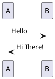

I use a text to diagram tool called [PlantUML](http://plantuml.org). Its perfect!
Now, I want to use it with my hugo site, through a short code. So, I I type a 
code like below, I should see out like as the image.
<!-- more -->
```markdown
@startuml
A -> B : Hello
A <- B : Hi There!
@enduml
```

**Update**: I spend many hourse trying to work this out. Created a firebase function to process posting and converting and yada yada. But finally gave up on Hugo. Until there is a plugin support in the core, this will be a very challenging thing. 

During my (failed) research, I ran into [Hexo](https://hexo.io) and [PlantUML filter plugin](https://www.npmjs.com/package/hexo-filter-plantuml). I saw a a [WordPress Migration](https://www.npmjs.com/package/hexo-migrator-wordpress) plugin. I decided to give it a go. 

In less than 20 minutes, I managed to install hexo, create a project, migrate wordpress items and got plantuml working.




I guess I will have to wait for hugo to mature a bit more. I really liked the speed and simplicity of hugo. But lack of plugin support in processing really killed it.
