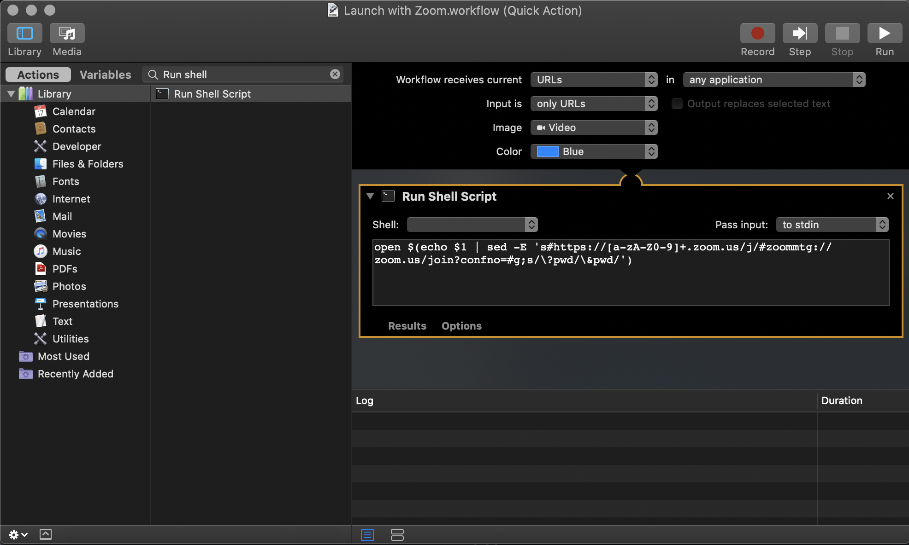

Simple Automator Workflow to Get rid of "Open zoom.us.app" on Mac

<!--more-->

## How to Install

1. Download workflow file and extract
1. Double click on "Launch with Zoom.workflow"
1. Click "Install" on Dialog

## How to Use

1. On and zoom link, just Right click > Services > Launch with Zoom
   

   **OR**

1. Select zoom link
1. On Mac Touch bar > Quick Action > "Launch with Zoom"

[Click here to get Mac Automator Workflow](workflow.zip)
